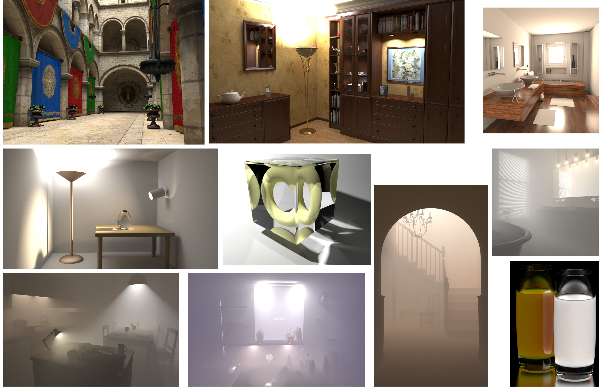

Light Transport Simulation in the Gradient Domain
-------------------------------------------------------------------------

  Light transport simulation in the gradient domain is an efficient family of Monte Carlo rendering techniques that can converge a few times faster than standard Monte Carlo rendering. The basic idea of gradient-domain rendering is to first efficiently sample the horizontal and vertical gradient images in addition to the standard Monte Carlo rendering. The final image can be reconstructed from the gradients by solving an image-space Poisson problem. The final image can be seen as a denoised result of standard Monte Carlo rendering. 
  
  This repository contains several gradient-domain light transport simulation algorithms. It derives Mitsuba 0.5.0 and includes the gradient domain implementation of path tracing, bidirectional path tracing, photon mapping, vertex connection and merging. It also supports rendering participating media with volumetric photon mapping, beam radiance estimates, photon beams, and planes. The repository is made to support the course [Light Transport Simulation in the Gradient Domain](http://beltegeuse.s3-website-ap-northeast-1.amazonaws.com/research/2018_GradientCourse/) in SIGGRAPH Asia 2018 and the state-of-the-art report [A Survey on Gradient-Domain Rendering](http://beltegeuse.s3-website-ap-northeast-1.amazonaws.com/research/2019_GradientSTAR/) in Eurographics 2019. 

  In case of problems/questions/comments don't hesitate to contact us
  directly: adrien.gruson@gmail.com or binhson.hua@gmail.com.

Integrators
-----------

This code includes several integrators originally implemented by many other researchers:
 - [Gradient-domain path tracing](https://github.com/mmanzi/gradientdomain-mitsuba) (SIGGRAPH 2015)
 - [Gradient-domain bidirectional path tracing](https://github.com/mmanzi/gradientdomain-mitsuba) (EGSR 2015)
 - [Gradient-domain photon density estimation](https://github.com/gradientpm/gpm) (Eurographics 2017)
 - [Gradient-domain vertex connection and merging](https://github.com/sunweilun/Mitsuba) (EGSR 2017)
 - [Gradient-domain volume photon density estimation](https://github.com/gradientpm/gvpm) (SIGGRAPH 2018)

The code is located in the `src/integrator/gradient` folder.

Image reconstruction
--------------------
For image reconstruction, it includes:
 - [L1 and L2 reconstruction](https://github.com/mmanzi/gradientdomain-mitsuba)
 - [Uniform and weighted reconstruction based on control variates](https://cs.dartmouth.edu/~wjarosz/publications/rousselle16image.html) (SIGGRAPH Asia 2016)

Currently, weighted reconstruction only supports gradient-domain path tracing. This reconstruction requires an estimate of the variance of the pixel value and its gradients. The support for other algorithms requires some extensions of this variance estimates which we temporarily leave as future work.

Scenes
------

### Surface rendering
- [Bathroom](http://beltegeuse.s3-website-ap-northeast-1.amazonaws.com/research/2017_GPM/bathroom3_scene.zip)
- [Sponza](http://beltegeuse.s3-website-ap-northeast-1.amazonaws.com/research/2017_GPM/sponza_scene.zip)
- [Bookshelf](http://beltegeuse.s3-website-ap-northeast-1.amazonaws.com/research/2017_GPM/bookshelf_scene.zip)
- [Torus](http://beltegeuse.s3-website-ap-northeast-1.amazonaws.com/research/2017_GPM/torus_scene.zip)
- [Veach-Lamp](http://beltegeuse.s3-website-ap-northeast-1.amazonaws.com/research/2017_GPM/veach-lamp_scene.zip)

### Volume rendering
- [Kitchen](http://beltegeuse.s3-website-ap-northeast-1.amazonaws.com/research/2018_GVPM/kitchen_scene.zip)
- [Staircase](http://beltegeuse.s3-website-ap-northeast-1.amazonaws.com/research/2018_GVPM/staircase_scene.zip)
- [Bathroom](http://beltegeuse.s3-website-ap-northeast-1.amazonaws.com/research/2018_GVPM/bathroom_scene.zip)
- [Spotlight](http://beltegeuse.s3-website-ap-northeast-1.amazonaws.com/research/2018_GVPM/spotlight_scene.zip)
- [Glass](http://beltegeuse.s3-website-ap-northeast-1.amazonaws.com/research/2018_GVPM/glass_scene.zip)

Denoisers
---------
To support the comparison of gradient-domain image reconstruction with Monte Carlo denoising techniques, the code also includes two popular denoising techniques:
 - [Nonlinearly Weighted First-order Regression for Denoising Monte Carlo Renderings (NFOR)](https://benedikt-bitterli.me/nfor/) (EGSR 2016)
 - [Bayesian Collaborative Denoising for Monte Carlo Rendering (BCD)](https://perso.telecom-paristech.fr/boubek/papers/BCD/) (EGSR 2017)

Currently, this two denoisers are only compatible with path tracing. They require the auxilary buffer (NFOR) or samples histograms (BCD).

Troubleshooting
---------------
  - Make sure that the config.py files use DOUBLE_PRECISON flag instead
  of SINGLE_PRECISION since the current implementation of gradient-domain rendering is quite sensitive to floating point precision. This will hopefully be fixed at a later time.

Change logs
-----------

  2018/11/29: Initial code release

License
-------

This code is released under the GNU General Public License (version 3).

This source code includes the following open source implementations:

- Screened Poisson reconstruction code from NVIDIA, released under the new BSD license.
- Mitsuba 0.5.0 by Wenzel Jakob, released under the GNU General Public License (version 3).
- A small part of [Tungsten](https://github.com/tunabrain/tungsten) by Benedikt Bitterli.
